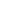
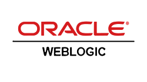

## About Me

------

Innovative, easy to work with, grower/giver mindset, skills current.

Deep experience with development and operations, monitoring, provisioning, network/infrastructure/business process automation, software development, cybersecurity (former CISSP). Effective in force-multiplier roles.

Successfully telecommuting for over 20 years.

As an individual contributor I have invented new capabilities for well established tech and have also done a few things that are not supposed to be possible.

As a manager, I grow the bench. My staff are regularly sought after as internal hires.

------

## Tools and languages

  
  
  
  
  
  
  
  
  
  
  
  
  
  
  
  
  
  
  
  
  
  
  
  
  
  
  
  
  
  
  
  
  
  
  
  
  
  
  
  
  
  
  
  
  
  
  
  
  
  
  
  
  
  
  
  
  
  
  
  
  
  
  
  
  
  
  
  
  
  
  
  
  
  
  
  
  
  
  
  
  
  
  
  
  
  
  
  
  
  
  
    
  
  
  
  
  
  
  
  
  
  
  
  
  
  
  
  
  
  
  
  
  
  
  
  
  
  
  
  
  
  
  
  
  
  
  
  
  
  
  
  
  
  
  
  
  
  
  
  
  
  
  
  
  
  
  
  
  
  
  
  
  
  
  
  
  
  
  
  
  

------

## Certifications

  
  
  
  
  
  
  
  
  
  
  
  
  
  
  
  
  

------

## Connect with me

  
  

